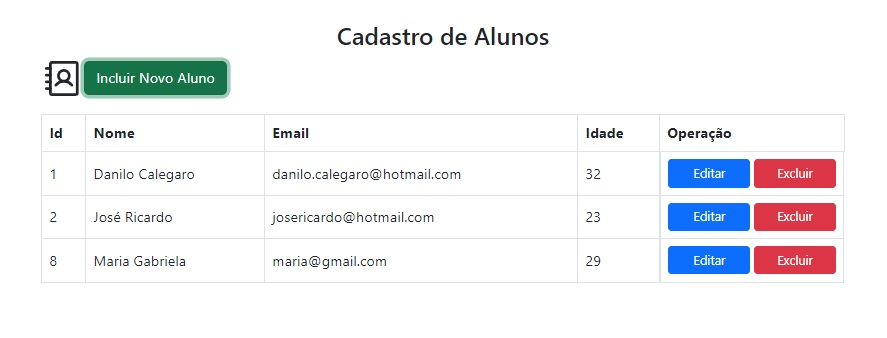

# CRUD para Registro e Controle de Alunos

## Tabela de conteúdos

- [CRUD para Registro e Controle de Alunos](#crud-para-registro-e-controle-de-alunos)
  - [Tabela de conteúdos](#tabela-de-conteúdos)
  - [Visão Geral](#visão-geral)
    - [O Projeto](#o-projeto)
    - [Captura de Tela](#captura-de-tela)
    - [Recursos utilizados](#recursos-utilizados)
  - [Pré-requisitos](#pré-requisitos)
    - [Inicialização da API](#inicialização-da-api)
    - [Inicialização do Dashboard](#inicialização-do-dashboard)
  - [Autor](#autor)
  
## Visão Geral

### O Projeto

O projeto consiste em um CRUD básico para inclusão, edição e exclusão de aluno.

Este foi desenvolvido como um todo, o back end criado com Asp.net Core com Entity Framework que manipula os dados no banco de dados SqlServer e gera uma API que é possível o front end em ReactJS interagir com o usuário para realizar as operações básicas na aplicação.

### Captura de Tela

### Recursos utilizados

- [yarn](https://yarnpkg.com/) - Gerenciador de pacotes do projeto.
- [ReactJS](https://reactjs.org/) - Uma biblioteca JavaScript para construir interfaces de usuário.
- [TypeScrip](https://www.typescriptlang.org/) - Uma linguagem de programação fortemente tipada que se baseia em JavaScript.
- [React Hooks](https://pt-br.reactjs.org/docs/hooks-reference.html) - Eles permitem que você use o state e outros recursos do React sem escrever uma classe.
- [Bootstrap](https://getbootstrap.com/) - Kit de ferramentas de front-end poderoso, extensível e repleto de recursos.
- [Axios](https://axios-http.com/)- cliente HTTP baseado em promisses.
- [Asp.Net Core](https://learn.microsoft.com/pt-br/dotnet/core/introduction) - é uma plataforma de desenvolvedor multiplataforma de código aberto gratuita para criar muitos tipos de aplicativos.
- [Entity Framework](https://learn.microsoft.com/pt-br/ef/) - é um mapeador moderno de banco de dados de objeto para .NET.
- [SQL Server](https://www.microsoft.com/pt-br/sql-server/) - banco de dados.

## Pré-requisitos

É necessário estar instalado:

- VSCode
- Visual Studio 2022
- Microsoft SQL Server 2019

Para executar o projeto *local* utilizamos as etapas abaixo após realizar o download ou clone do repositório:

### Inicialização da API

Após iniciarmos o Visual Studio 2022, devemos seguir as seguintes etapas para executar a API:

- Abrir o projeto contido na pasta StudentApi.

- Devemos encontrar o arquivo `appsettings.json` e alterarmos o `DefaultConnection` para a string de conexão correta do banco de dados instalado.
  
- Executar a aplicação com IIS Express

Assim será montado nossa API e exibida uma página do SwaggerUI mostrando os endpoints disponíveis.

### Inicialização do Dashboard

Para o front end devemos iniciar o VSCode e abrir o projeto contido na pasta dashboard-students e executar os comandos:

> yarn install
>
> yarn run dev

E a aplicação estará pronta para ser visualizada e operada no endereço [http://localhost:5173](http://localhost:5173).

## Autor

Portfólio - [danilocalegaro.dev.br](https://danilocalegaro.dev.br/)
